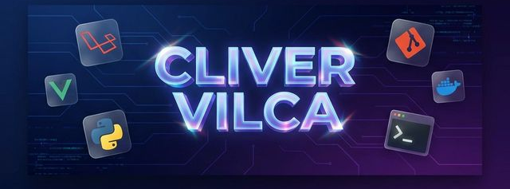

<!-- 
  SYSTEM ARCHITECT PROFILE: CLIVER VILCA
  ENGINEERING LEVEL: SENIOR STATISTICAL & SOFTWARE ENGINEER
  THEME: TOKYONIGHT DARK / GLASSMORPHISM
-->
# 

  <!-- BANNER LOCAL: Sube tu banner personalizado a assets/banner.png -->
  

<!-- ENGINEERING STATUS BAR: Dinámica, limpia y profesional -->

  
  
  
  

<!-- SECTION: PROFESSIONAL SYNOPSIS -->
<table align="center" border="0">
  <tr>
    <td width="60%" valign="top">
      <h3> 𝕰𝖓𝖌𝖎𝖓𝖊𝖊𝖗𝖎𝖓𝖌  ����𝖊𝖘𝖙𝖔</h3>
      

        Soy un <b>Ingeniero Estadístico e Informático</b> especializado en el desarrollo de arquitecturas de software de alta complejidad. Mi propuesta de valor radica en la intersección de la <b>lógica matemática</b> y la <b>ingeniería de software</b>.
      

      

        Diseño soluciones <b>Full Stack</b> utilizando el ecosistema <b>Laravel</b> y <b>Vue.js</b>, garantizando siempre la integridad de los datos, la seguridad del sistema y un rendimiento óptimo.
      

       
      

        
        
      

    </td>
    <td width="40%" valign="center" align="center">
      <!-- IMAGEN LOCAL: Sube tu foto profesional o avatar tech a assets/profile_tech.png -->
      
        
      
    </td>
  </tr>
</table>
 
<!-- SECTION: CORE PILLARS -->
<h3 align="center">𝕮𝖔𝖗𝖊  𝕰𝖓𝖌𝖎𝖓𝖊𝖊𝖗𝖎𝖓𝖌  𝕻𝖎𝖑𝖑𝖆𝖗𝖘</h3>
<table align="center">
  <tr>
    <td width="50%">
      <ul>
        <li><b>Statistical Insights:</b> Decisiones basadas en la ciencia de datos.</li>
        <li><b>Clean Architecture:</b> Dominio profundo de SOLID y DDD.</li>
      </ul>
    </td>
    <td width="50%">
      <ul>
        <li><b>Full Stack Mastery:</b> Control total desde el Backend hasta el UI.</li>
        <li><b>Performance First:</b> Optimización de latencia y throughput.</li>
      </ul>
    </td>
  </tr>
</table>
 
<!-- SECTION: TECHNICAL STACK -->
<h3 align="center">𝕿𝖊𝖈𝖍𝖓𝖎𝖈𝖆𝖑  𝕰𝖈𝖔𝖘𝖞𝖘𝖙𝖊𝖒</h3>
<table align="center" border="0">
  <tr>
    <td align="center" width="25%"><b>Backend Logic</b></td>
    <td align="center" width="25%"><b>Frontend Design</b></td>
    <td align="center" width="25%"><b>Data & AI</b></td>
    <td align="center" width="25%"><b>DevOps & Tools</b></td>
  </tr>
  <tr>
    <td align="center">
      
    </td>
    <td align="center">
      
    </td>
    <td align="center">
      
    </td>
    <td align="center">
      
    </td>
  </tr>
</table>
 
<!-- SECTION: PROJECT SHOWCASE (WITH LOCAL ASSETS) -->
<h3 align="center">𝕸𝖎𝖘𝖘𝖎𝖔𝖓  𝕮𝖗𝖎𝖙𝖎𝖈𝖆𝖑  𝕻𝖗𝖔𝖏𝖊𝖈𝖙𝖘</h3>

  
  

  
  

 
<!-- SECTION: ANALYTICS -->
<h3 align="center">📈 𝕰𝖓𝖌𝖎𝖓𝖊𝖊𝖗𝖎𝖓𝖌  𝖁𝖊𝖑𝖔𝖈𝖎𝖙𝖞</h3>

  

  
  

 
<!-- SECTION: SNAKE (Nota: requiere GitHub Action para funcionar) -->
<h3 align="center">🐍 𝕾𝖞𝖘𝖙𝖊𝖒  𝕰𝖛𝖔𝖑𝖚𝖙𝖎𝖔𝖓  𝕲𝖗𝖎𝖉</h3>

  

 
<!-- SECTION: NETWORKING -->
<h3 align="center">🤝 𝕻𝖗𝖔𝖋𝖊𝖘𝖘𝖎𝖔𝖓𝖆𝖑  𝕹𝖊𝖙𝖜𝖔𝖗𝖐𝖎𝖓𝖌</h3>

  
  &nbsp;&nbsp;&nbsp;&nbsp;
  
  &nbsp;&nbsp;&nbsp;&nbsp;
  

 
<!-- FOOTER -->

  

  <i>"In God we trust, all others must bring data."</i>  
  <b>𝕺𝖕𝖙𝖎𝖒𝖎𝖟𝖆𝖉𝖔  𝖕𝖔𝖗  𝕮𝖑𝖎𝖛𝖊𝖗  𝖁𝖎𝖑𝖈𝖆  |  𝕴𝖓𝖌𝖊𝖓𝖎𝖊𝖗𝖔  𝕰𝖘𝖙𝖆𝖉𝖎𝖘𝖙𝖎𝖈𝖔  𝖊  𝕴𝖓𝖋𝖔𝖗𝖒𝖆𝖙𝖎𝖈𝖔</b>

