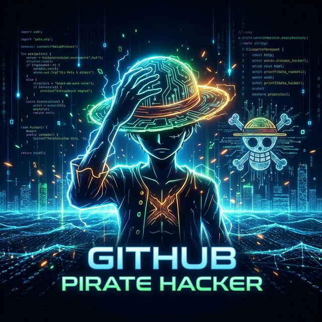

# 

  

  

  

---

###  **Engineering Odyssey**

<table align="center" border="0">
  <tr>
    <td width="60%" valign="top">
      

        As a <b>Full Stack Developer</b>, I don't just write code; I architect experiences. My journey is defined by a relentless search for <i>The One Piece</i> of software: that perfect balance between robust backend logic and fluid, reactive interfaces. I specialize in the <b>Laravel</b> ecosystem, bringing enterprise-grade stability to every project I touch.
      

       
      

        
        
      

       
      <code>
        // Current Stack Execution: 
        $profile = new Developer(['Cliver Vilca']); 
        $profile->specializeIn(['Laravel', 'Vue.js', 'Python', 'IA']); 
        $profile->executeMission('Building the Future');
      </code>
    </td>
    <td width="40%" valign="center" align="right">
      
    </td>
  </tr>
</table>

---

###  **Technical Arsenal**

  

  

---

###  **Mission Critical Projects**

  
  &nbsp;
  

---

###  **Digital Pulse**

  

  
  

---

###  **Contributions in Motion**

  

---

### 
**Let's Build Something Legendary**

  
  &nbsp;&nbsp;&nbsp;
  

  

  

